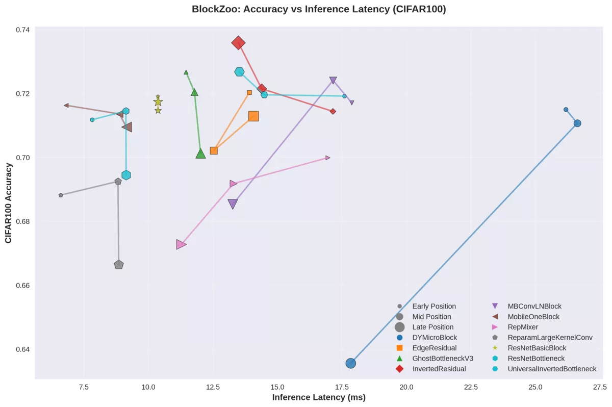

# BlockZoo

**BlockZoo** provides a standardized framework to benchmark and profile convolutional blocks in isolation. By embedding blocks into a fixed scaffold architecture at different positions (early, mid, late), we can measure block specialization and performance.

The motivation behind this project was the demise of benchmarks from paperswithcode and a desire to have a more fair comparison of convolutional blocks.

[](https://www.python.org/)
[](https://pytorch.org/)
[](https://lightning.ai/)

## Results



Each data point represents the mean performance from 5 training runs of each block architecture tested across all three scaffold positions (early/mid/late) on CIFAR-100 over 50 epochs.

Iterated benchmarking reveals distinct performance characteristics across block architectures. While some designs like RepMixer and DYMicroBlock show clear limitations for image classification tasks, the majority of blocks form an interesting Pareto frontier trading off accuracy versus inference latency. MobileOneBlock emerges as exceptional for high-throughput applications, delivering competitive accuracy with remarkably low latency through its reparameterization strategy. Meanwhile, inverted residual architectures (InvertedResidual, UniversalInvertedBottleneck, EdgeResidual) consistently achieve high accuracy scores, validating their widespread adoption in mobile-optimized networks. It's difficult to make the comparison strictly fair given differing FLOPs and parameter counts, but these results use the "default" configurations of each block as defined in their original papers.

## Features

- **Scaffold Architecture**: Fixed stem → StageA → StageB → StageC → head for consistent evaluation
- **Positional Analysis**: Test blocks in early/mid/late positions to measure specialization
- **Comprehensive Profiling**: FLOPs, parameters, memory usage, and runtime benchmarking
- **Lightning Integration**: Robust training pipeline with PyTorch Lightning
- **CSV Export**: Structured results for analysis and visualization

## Quick Start

### Installation

```bash
git clone git@github.com:Teque5/blockzoo.git
pip install --editable .
```

### Basic Usage

#### Profile a Block
```bash
python -m blockzoo.profile ResNetBasicBlock --position mid
```

#### Benchmark Runtime Performance
```bash
python -m blockzoo.benchmark ResNetBasicBlock --position mid --device cuda
```

#### Full Training & Evaluation
```bash
python -m blockzoo.train ResNetBasicBlock --position mid --epochs 5
# Results saved to results/results.csv
```

#### Run All Benchmarks
```bash
python3 scripts/bench_all.py
```

## Positional Specialization Protocol

The core innovation of BlockZoo is measuring how blocks perform across different network positions. This protocol helps identify whether blocks are specialized for local features (early layers) or global features (late layers).

### Protocol Overview

1. **Fixed Scaffold**: Use ScaffoldNet with identical stem/head across all experiments
2. **Three Canonical Positions**:
   - **Early** (Stage A): High resolution, small receptive field, local context
   - **Mid** (Stage B): Medium resolution with 2x downsampling, balances local and global context
   - **Late** (Stage C): Low resolution with 4x downsampling, global context
3. **Isolation Testing**: Only one stage active per experiment
4. **Consistent Training**: Same optimizer, schedule, and data across positions

### Position Comparison Example

```bash
# Test ResNet BasicBlock across all positions
python -m blockzoo.train ResNetBasicBlock --position early --epochs 10
python -m blockzoo.train ResNetBasicBlock --position mid --epochs 10
python -m blockzoo.train ResNetBasicBlock --position late --epochs 10

# Analyze results
python -c "
import pandas as pd
df = pd.read_csv('results/results.csv')
print(df.groupby('position')[['val_acc', 'params_total', 'latency_ms']].mean())
"
```

## Architecture Details

### ScaffoldNet Structure

```
Input (3×32×32)
    ↓
Stem: Conv3x3(3→64) + BN + ReLU
    ↓
Stage A (Early): 64→64, stride=1, high-res, 3x blocks
    ↓
Stage B (Mid): 64→128, stride=2, medium-res, 3x blocks
    ↓
Stage C (Late): 128→256, stride=2, low-res, 3x blocks
    ↓
Head: AdaptiveAvgPool + Linear(256→classes)
    ↓
Output (classes,)
```

**Key Design Choices:**
- **Fixed Stem/Head**: Ensures consistent feature extraction/classification
- **Single Active Stage**: Isolates block performance
- **Progressive Channels**: 64 → 128 → 256 following common practices
- **Controlled Downsampling**: 2× at each transition

**Available Block Types:**

All blocks are defined in the BlockZoo registry and follow the unified `(in_channels, out_channels, stride, position)` interface:

- **ResNet blocks**: `ResNetBasicBlock`, `ResNetBottleneck`
- **EfficientNet blocks**: `InvertedResidual`, `UniversalInvertedBlock`, `EdgeResidual`

To see all available blocks:
```python
from blockzoo.wrappers import list_available_blocks
print("Available blocks:", list_available_blocks())
```

## Python API

### Using Your Own Block

```python
from torch import nn
from blockzoo import ScaffoldNet

class MyCustomBlock(nn.Module):
    """Custom convolutional block."""

    def __init__(self, in_channels, out_channels, stride, position):
        super().__init__()
        self.conv1 = nn.Conv2d(in_channels, out_channels, 3, stride, 1)
        self.bn1 = nn.BatchNorm2d(out_channels)
        self.relu = nn.ReLU(inplace=True)
        self.conv2 = nn.Conv2d(out_channels, out_channels, 3, 1, 1)
        self.bn2 = nn.BatchNorm2d(out_channels)

        # Shortcut connection
        self.shortcut = nn.Sequential()
        if stride != 1 or in_channels != out_channels:
            self.shortcut = nn.Sequential(
                nn.Conv2d(in_channels, out_channels, 1, stride, 0),
                nn.BatchNorm2d(out_channels)
            )

    def forward(self, x):
        out = self.relu(self.bn1(self.conv1(x)))
        out = self.bn2(self.conv2(out))
        out += self.shortcut(x)
        return self.relu(out)

# Register and train your block
from blockzoo.wrappers import BLOCK_REGISTRY
BLOCK_REGISTRY['MyCustomBlock'] = MyCustomBlock

# Train via CLI
# python -m blockzoo.train MyCustomBlock --position mid --epochs 10
```


## Results Analysis

Results are saved to CSV with columns for accuracy, parameters, FLOPs, latency, and more:

```python
import pandas as pd

# Load and analyze results
df = pd.read_csv('results/results.csv')
position_analysis = df.groupby(['block', 'position']).agg({
    'val_acc': 'mean',
    'params_total': 'mean',
    'latency_ms': 'mean'
}).round(4)

print(position_analysis)
```

## Testing

```bash
# Run all tests
coverage run
```
